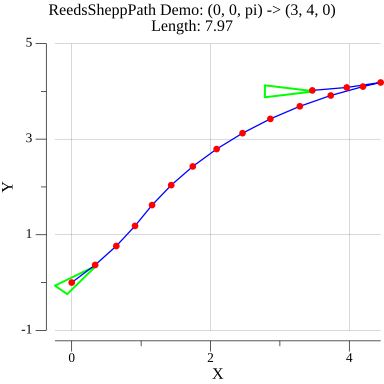

# reedsshepp demo

> reedsshepp Length, Interpolate demo, based on python [pyReedsShepp](https://github.com/ghliu/pyReedsShepp/tree/master) demo

## Results
|   |   |                     |
|:-------------------:|:-------------------:|:-------------------:|
|  |  |  |
|  |  |  |

## Run
```bash
go mod tidy
go run main.go
```

